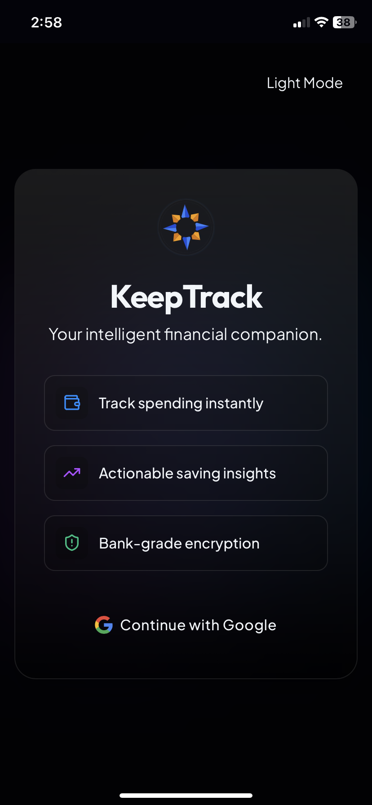
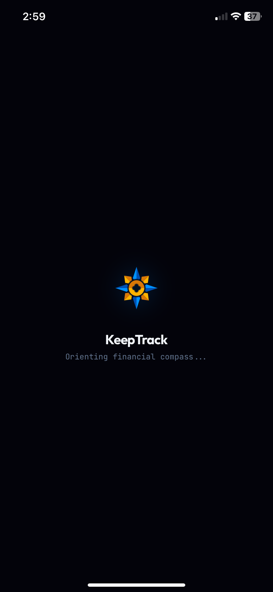
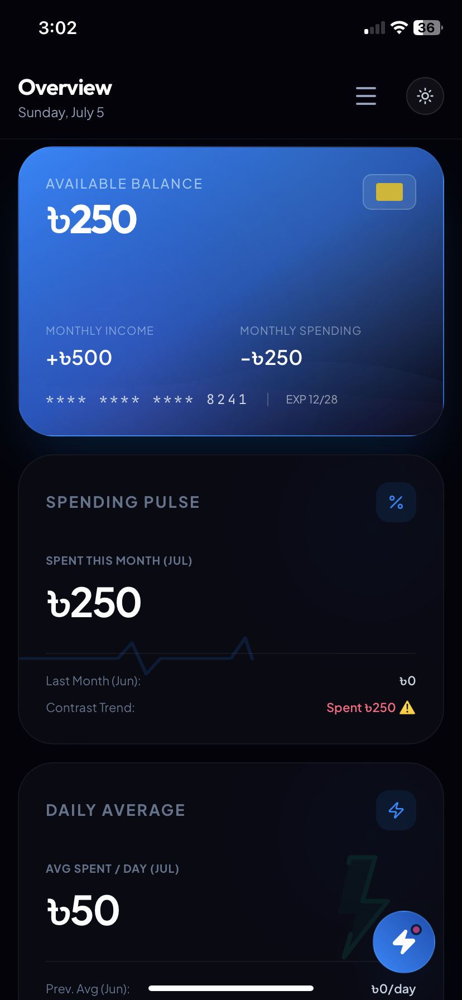
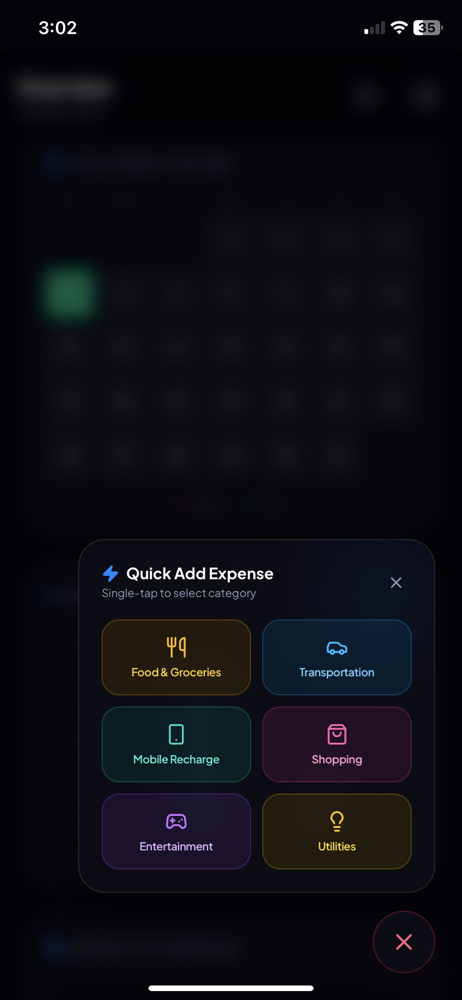
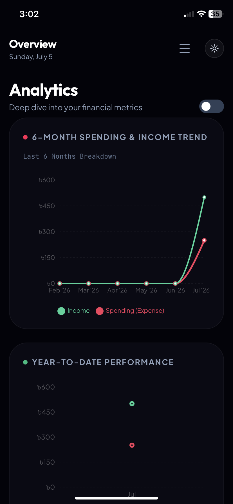
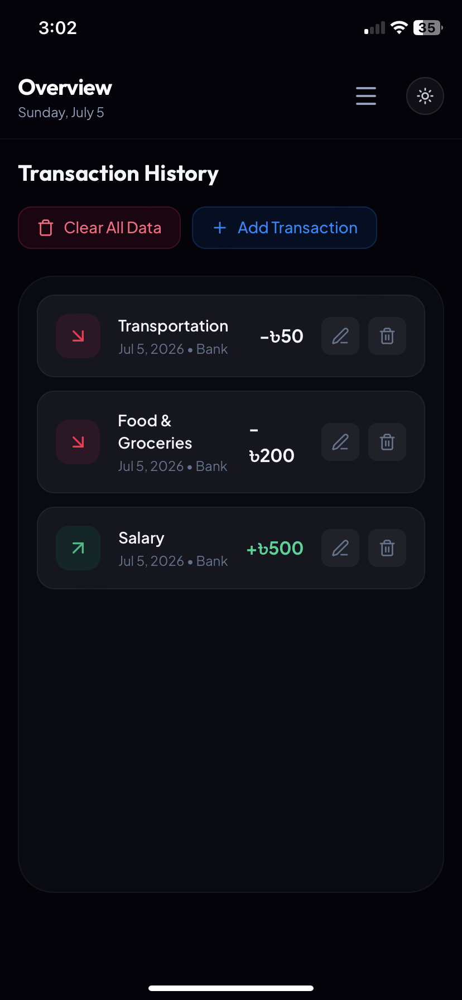
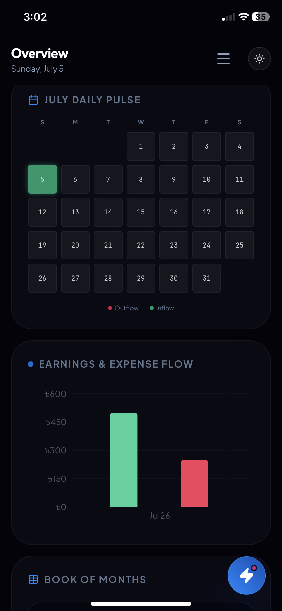

<div align="center">


### 🧭 A premium financial compass for your money

<a href="https://readme-typing-svg.demolab.com/">
  
</a>

<br />

[](https://keeptrack2.netlify.app/)

<br />


<br />


</div>

<br />

## 📖 Table of Contents

- [Introduction](#-introduction--theme-philosophy)
- [Screenshots](#-screenshots)
- [Key Features](#-key-features)
- [Tech Stack & Architecture](#-tech-stack--architecture)
- [Installation & Quick Start](#-installation--quick-start)
- [Firestore Security Rules](#-firestore-security-rules)
- [Contributing](#-contributing)
- [License](#-license)
- [Author](#-author)

<br />


## 🧭 Introduction & Theme Philosophy

KeepTrack is built around a single idea: **your financial dashboard should feel less like a spreadsheet and more like an instrument panel.**

The entire product is designed under the **"Financial Compass"** visual language — a design system that borrows from three disciplines:

| Principle | Application in KeepTrack |
|---|---|
| 🅰️ **Swiss Typographic Rigor** | Strict type scales, generous whitespace, and high-contrast numerals so balances and figures are legible at a glance — no squinting at your net worth. |
| 📡 **Instrument-Grade Visual Feedback** | Every core metric — balance, spending pace, budget health — is represented by a *living* visual (waves, pulses, radars) rather than a static number, so trends are felt before they're read. |
| 🌊 **Lightweight, Purposeful Motion** | Powered by `motion`, animations are spring-based and physically believable — subtle enough to never distract, present enough to make the interface feel alive. |

The result is an app that behaves less like a ledger and more like a **compass** — always orienting you toward where your money is actually going.

> 🔗 **Experience it live:** [**keeptrack2.netlify.app**](https://keeptrack2.netlify.app/)

<br />

## 📸 Screenshots

<div align="center">

<table>
<tr>
<td width="50%" align="center">

<br/>
<b>🔐 Login Page</b>
<br/>
<sub>Animated compass emblem · Email &amp; Google SSO</sub>
</td>
<td width="50%" align="center">

<br/>
<b>🧭 Loading Screen</b>
<br/>
<sub>"Syncing financial compass…"</sub>
</td>
</tr>
</table>

<br/>


<br/>
<b>🏠 Dashboard</b> — Balance Waves · Spending Pulse · Daily Average · Monthly Budget
<br/><br/>

<table>
<tr>
<td width="50%" align="center">

<br/>
<b>⚡ Quick Add Expense</b>
<br/>
<sub>Log a transaction in seconds, synced instantly</sub>
</td>
<td width="50%" align="center">

<br/>
<b>📊 Analytics</b>
<br/>
<sub>Category breakdowns powered by Recharts &amp; D3</sub>
</td>
</tr>
<tr>
<td width="50%" align="center">

<br/>
<b>📜 Transaction History</b>
<br/>
<sub>Filterable, real-time transaction ledger</sub>
</td>
<td width="50%" align="center">

<br/>
<b>📅 Calendar View</b>
<br/>
<sub>Transactions mapped day-by-day across the month</sub>
</td>
</tr>
</table>

</div>

> 💡 Place the corresponding image files inside a `screenshots/` folder at the project root, matching the filenames referenced above.

<br />

## ✨ Key Features

### 🧭 The Financial Compass Logo
A custom, hand-crafted SVG compass mark that reacts to hover with gentle spring physics — the needle subtly re-orients as if sensing the cursor, reinforcing the "navigation" metaphor across the entire product.

### 📊 Dynamic Dashboard
The homepage is composed of four signature instrument cards, each with a bespoke animated visualization:

| Card | Visualization | What It Communicates |
|---|---|---|
| **Balance Card** | Fluid, animated cash-flow waves | Your available balance, rendered like water in motion — rising and settling as funds move. |
| **Spending Pulse Card** | Live ECG-style cardiogram wave | The "heartbeat" of your spending activity in real time. |
| **Daily Average Card** | Charging lightning-bolt animation | Your average daily spend/output, visualized as stored energy being discharged. |
| **Monthly Budget Card** | Concentric, rotating radar rings | Progress toward your monthly budget target, read like a targeting reticle closing in. |

### 🔄 Real-Time Transaction Management
Add, edit, delete, and filter transactions with **instant Firestore synchronization** — changes reflect across devices without a manual refresh.

### 💰 Smart Budgets
A fully interactive budget configurator that lets you set per-category limits. Overspending is never ambiguous — categories that blow past their limit are flagged in **high-contrast crimson**, immediately and unmissably.

### 📈 Analytics View
Clean, responsive breakdowns of income vs. expense, category distribution, and trends over time — powered by Recharts and D3 for smooth, data-accurate visualizations at any screen size.

### 🔐 Auth Barrier
A refined login/signup experience anchored by a large-format animated compass emblem, supporting both **Email/Password** and **Google Single Sign-On**, backed by Firebase Authentication.

### 🌗 Dark / Light Theming
A first-class theme context drives the entire app's palette — both modes are tuned for high-contrast legibility, not just an inverted color scheme.

### ⏳ Signature Loading Experience
A custom loading screen featuring multiple concentric rotating rings around a central compass pointer, labeled **"Syncing financial compass…"** — turning even the wait state into part of the brand experience.

<br />

## 🏗 Tech Stack & Architecture

### Core Stack

| Layer | Technology | Purpose |
|---|---|---|
| **Framework** | React 18+ (Vite) | Fast HMR dev environment, optimized production builds |
| **Language** | TypeScript | End-to-end type safety across components, hooks, and Firestore models |
| **Styling** | Tailwind CSS | Utility-first, fully responsive design across mobile & desktop breakpoints |
| **Animation** | `motion` (Framer Motion v11) | Spring-based transitions and micro-interactions |
| **Auth & Database** | Firebase Authentication + Firestore | Email/Google sign-in, cloud-synced, per-user structured data |
| **Data Visualization** | Recharts + D3 | Responsive cashflow charts and category breakdowns |
| **Icons** | Lucide React | Consistent, lightweight iconography |

### Architectural Overview

```
┌─────────────────────────────────────────────────────────┐
│                         Client (React)                   │
│                                                            │
│   ┌────────────┐   ┌───────────────┐   ┌──────────────┐  │
│   │  Auth Layer │→│  Theme Context │→│  Dashboard UI  │  │
│   └────────────┘   └───────────────┘   └──────────────┘  │
│                                              │             │
│                     ┌────────────────────────┴─────────┐  │
│                     │   Recharts / D3 Visualizations    │  │
│                     └────────────────────────────────────┘ │
└──────────────────────────────┬─────────────────────────────┘
                                │
                     Firebase SDK (Auth + Firestore)
                                │
┌───────────────────────────────▼───────────────────────────┐
│                          Firebase                          │
│   ┌───────────────┐        ┌────────────────────────────┐ │
│   │ Authentication │        │ Firestore (per-user paths) │ │
│   └───────────────┘        └────────────────────────────┘ │
└──────────────────────────────────────────────────────────┘
```

### Project Structure

```
keeptrack/
├── assets/
│   └── logo.svg              # Animated compass logo
├── screenshots/               # README screenshots
├── src/
│   ├── assets/                # Compass logo SVGs, static illustrations
│   ├── components/
│   │   ├── dashboard/         # Balance, Pulse, Average, Budget cards
│   │   ├── charts/            # Recharts/D3 chart wrappers
│   │   ├── auth/              # Login/Signup UI
│   │   └── ui/                # Shared primitives (buttons, modals, inputs)
│   ├── context/                # ThemeContext, AuthContext
│   ├── hooks/                  # useTransactions, useBudgets, useFirestore
│   ├── lib/                    # firebase.ts (SDK init), utils
│   ├── types/                  # TypeScript models (Transaction, Budget, User)
│   ├── App.tsx
│   └── main.tsx
├── .env.example
├── firestore.rules
├── tailwind.config.ts
├── vite.config.ts
└── package.json
```

<br />

## 🚀 Installation & Quick Start

### Prerequisites

- **Node.js** ≥ 18.x
- **npm** ≥ 9.x
- A **Firebase project** with Authentication (Email/Password + Google) and Firestore enabled

### 1. Clone the repository

```bash
git clone https://github.com/Joy5691/KeepTrack.git
cd KeepTrack
```

### 2. Install dependencies

```bash
npm install
```

### 3. Configure environment variables

Create a `.env` file in the project root using the template below:

```bash
cp .env.example .env
```

```env
# .env
VITE_FIREBASE_API_KEY=your_api_key
VITE_FIREBASE_AUTH_DOMAIN=your_project.firebaseapp.com
VITE_FIREBASE_PROJECT_ID=your_project_id
VITE_FIREBASE_STORAGE_BUCKET=your_project.appspot.com
VITE_FIREBASE_MESSAGING_SENDER_ID=your_sender_id
VITE_FIREBASE_APP_ID=your_app_id
```

> ⚠️ **Never commit your `.env` file.** Ensure it's listed in `.gitignore` before pushing to a remote repository.

### 4. Run the development server

```bash
npm run dev
```

The app will be available at `http://localhost:5173`.

### 5. Build for production

```bash
npm run build
```

Optimized static assets are output to the `dist/` directory, ready for deployment (e.g. Netlify, Vercel).

### 6. Preview the production build locally

```bash
npm run preview
```

<br />

## 🔐 Firestore Security Rules

KeepTrack isolates every user's financial data behind their authenticated UID. No user can read or write another user's transactions, budgets, or profile data — enforced at the database layer, not just the client.

```js
rules_version = '2';

service cloud.firestore {
  match /databases/{database}/documents {

    // Users can only access their own document
    match /users/{userId} {
      allow read, update, delete: if request.auth != null && request.auth.uid == userId;
      allow create: if request.auth != null && request.auth.uid == userId;

      // Transactions are nested under the owning user
      match /transactions/{transactionId} {
        allow read, write: if request.auth != null && request.auth.uid == userId;
      }

      // Budgets follow the same user-isolated pattern
      match /budgets/{budgetId} {
        allow read, write: if request.auth != null && request.auth.uid == userId;
      }
    }

    // Deny everything else by default
    match /{document=**} {
      allow read, write: if false;
    }
  }
}
```

**Design principles:**

- 🔒 **User-isolated paths** — all sensitive data lives under `users/{userId}/...`, never at the collection root.
- ✅ **Explicit allow, implicit deny** — the catch-all rule at the bottom denies any path not explicitly matched above.
- 🧾 **UID-bound ownership** — every read/write checks `request.auth.uid` against the path's `userId`, preventing cross-account data access even if a document ID is guessed.

<br />

## 🤝 Contributing

Contributions are welcome and appreciated. To propose a change:

1. **Fork** the repository
2. Create a feature branch
   ```bash
   git checkout -b feature/your-feature-name
   ```
3. Commit your changes with clear, descriptive messages
   ```bash
   git commit -m "Add: category-level spending forecast"
   ```
4. Push to your fork and open a **Pull Request** against `main`

Please keep PRs focused — one feature or fix per pull request — and ensure `npm run build` completes cleanly before submitting.

<br />

## 📄 License

This project is licensed under the **MIT License** — see the [LICENSE](./LICENSE) file for full terms.

```
MIT License

Copyright (c) 2026 Khalid Mahmud Joy

Permission is hereby granted, free of charge, to any person obtaining a copy
of this software and associated documentation files, to deal in the Software
without restriction, including without limitation the rights to use, copy,
modify, merge, publish, distribute, sublicense, and/or sell copies of the
Software, subject to the inclusion of the above copyright notice in all
copies or substantial portions of the Software.
```

<br />

## 👤 Author

<div align="center">


**Khalid Mahmud Joy**

Computer Science & Engineering · East West University

Designed, engineered, and navigated into existence by the author below.

[](https://github.com/Joy5691)
[](https://keeptrack2.netlify.app/)

</div>

<br />

<div align="center">

### ⭐ If KeepTrack helped you find your financial north, consider starring the repo!

<a href="#-keeptrack">⬆ Back to top</a>


</div>
